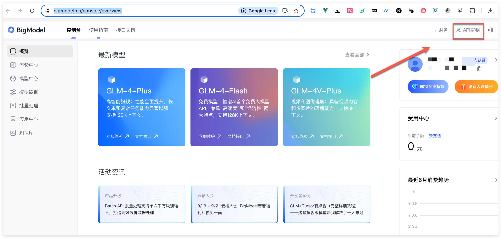

<h1 align="center">汉语新解</h1>

# 项目介绍

本插件由作者 🐼 **熊猫Jay** 借助 Cursor 开发，主要是借助全新的视角、辛辣的文字风格解读汉语词汇，最终形成清新优雅的卡片，帮助用户从另一面了解汉语言文化。

**1、核心功能**

* 解读汉语词汇形成卡片
* 卡片下载
* AI 大模型配置
* 更多功能迭代中...

**2、开发背景**

最初思路来自于 **@李继刚老师** 利用 **Lisp** 语法在 **Claude 3.5** 上利用 Artifacts 生成卡片。

后来我受到 **@云中江树**老师爆改的国内提示词影响，并借助 **免费，速度更快**的国内大模型 **GLM-4-Flash** 在谷歌插件上实现。

**3、插件实现思路**

由于只生成最核心的 JSON 结果（含解读、翻译、总结），所以速度更快，结果更稳定。

# 效果展示

**年终奖**：

**潜力股**：

**不鼓励加班**：

**升职**：

**钝力感**：

# 如何使用

## 安装插件

### 1、安装插件（谷歌商店）

谷歌商店地址：[汉语新解](https://chromewebstore.google.com/detail/%E6%B1%89%E8%AF%AD%E6%96%B0%E8%A7%A3/pnpajljeppgpoelfldccfnmhkidmahfc?hl=en-US&utm_source=ext_sidebar)

建议谷歌商店直接下载，更加方便。

### 2、安装插件（源码安装）

1、下载代码，通过 `Git Clone` 或者 `直接下载` 都可以，看个人喜好。下图为`直接下载`。

2、浏览器输入地址 `chrome://extensions/` 进入插件安装页面。

3、点击左上角 `Load unpacked` 加载从 GitHub 上下载的项目文件夹。

4、建议将插件显示到浏览器插件清单（可选）。

安装非常简单，基本上就结束了，但是暂时还不能用，接下来我们来配置 AI 大模型。

## 申请并配置大模型

1、浏览器访问 [智谱 AI 开放平台](https://www.bigmodel.cn/invite?icode=T7iYC9jW4YbXn6iCxIkCSlwpqjqOwPB5EXW6OL4DgqY%3D) , 注册或者登录账号。

2、登录成功后，进入 [控制台](https://bigmodel.cn/console/overview)，点击访问右上角 **API 密钥**。

3、创建 API 密钥后，再将对应的 API Key 复制下来。

4、最后，进入插件配置页面，将 **API Key** 配置到插件里。

5、保存配置

> 模型：glm-4-flash 完全免费。**glm-4-plus** 文字效果更好，不过有免费额度，但是，赠送的额度对大多数人来说，基本上也够用。

## 浏览器划词使用

1、进入任何网页，滑动选中想要解读的词汇，点击浮动按钮 **汉语新解**，等待侧边栏生成图片。

2、生成图片后，可以点击 **下载图片** 进行下载。

下载后图片的效果如下：

3、如果需要更换模型或者 API Key, 也可以点击 侧边栏的⚙️ 图标进入配置页面。

# FAQs

**Q1：模型和 API Key 配置完全正确的情况，但是划词后无法显示图片。**

A1：刷新页面重试，可能存在某些未知的 Bug，正在努力修复中。

# 已知问题

* **字数限制**：选择解读的字数过长时，可能会造成解析出来的卡片样式布局出现混乱，或者显示不全。
* **模板更换**： 由于是 MVP，模板暂时不支持更新，程序目前是随机选择卡片模板。
* **模型限制**：目前仅支持 GLM-4 相关模型，其他模型尚未测试。
* **浏览器版本适配性**：目前仅仅支持最新版 Chrome 浏览器，版本号：Version 128.0.6613.138，其他版本尚未测试。
* **部分网页不支持**：飞书目前不支持，插件需要逐步完善。

# 贡献指南

欢迎开发者共同参与本插件的开发，如果你有任何改进建议或代码贡献，欢迎提交PR，或与我直接联系。

# 链接作者

项目由 **熊猫 Jay** 开发，欢迎与我链接和交流，**公众号：「熊猫 Jay 字节之旅」**，欢迎关注我，定期分享 AI 相关的干货。

# 特别鸣谢

感谢 **@李继刚老师** 分享的 **汉语新解** 思路，感谢 **@云中江树老师** 分享的 **汉语新解-国内提示词** 思路。
