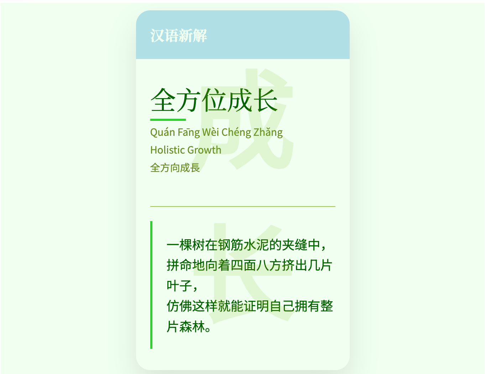
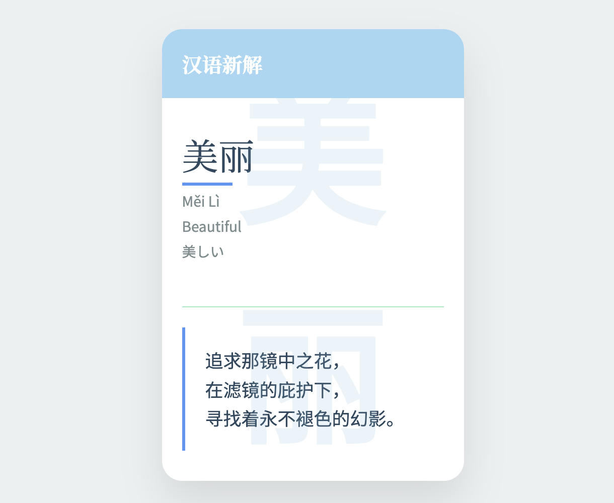
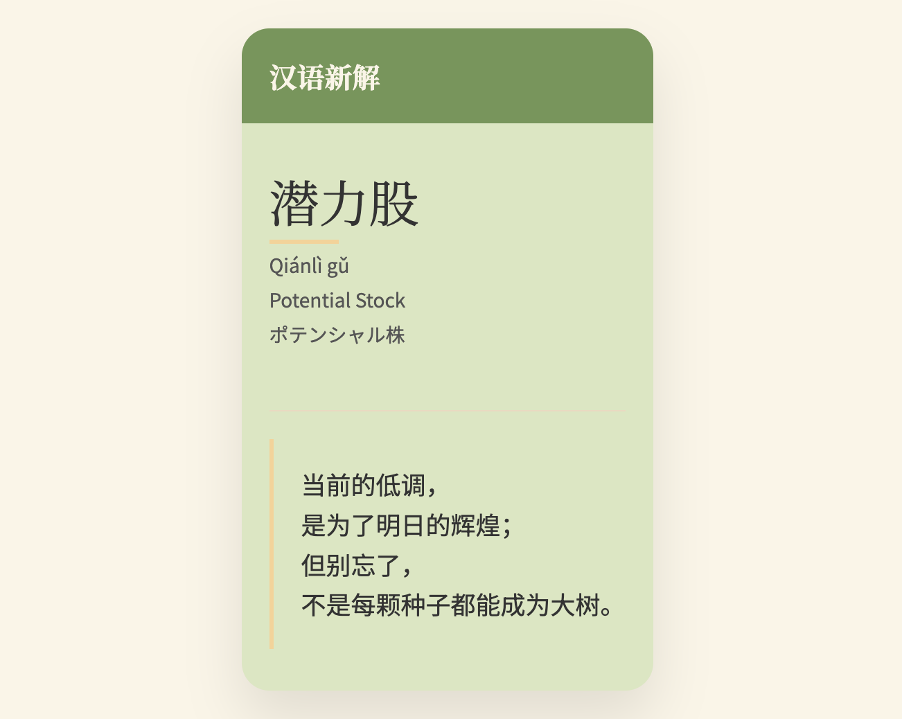
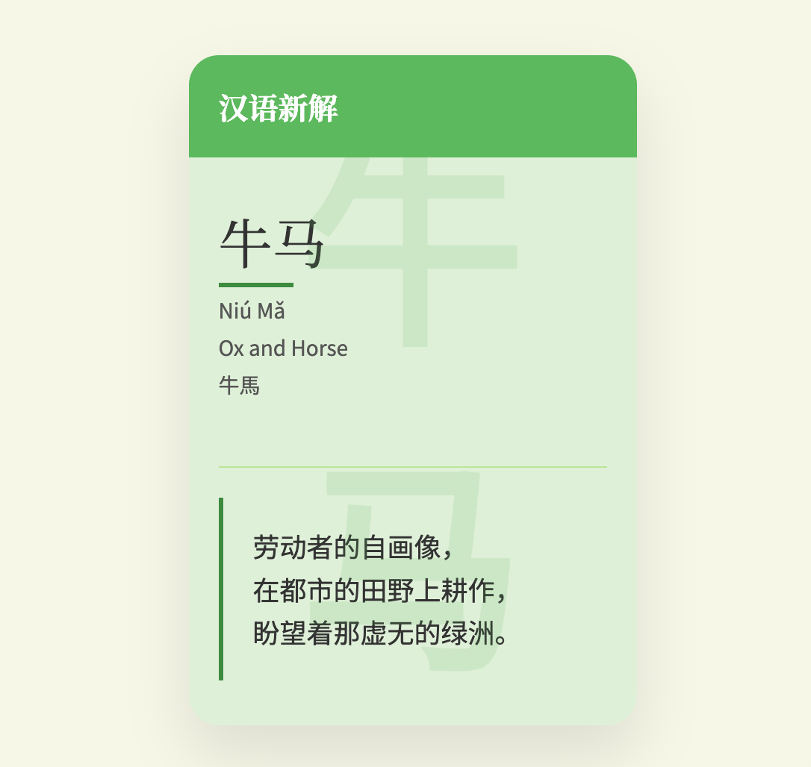
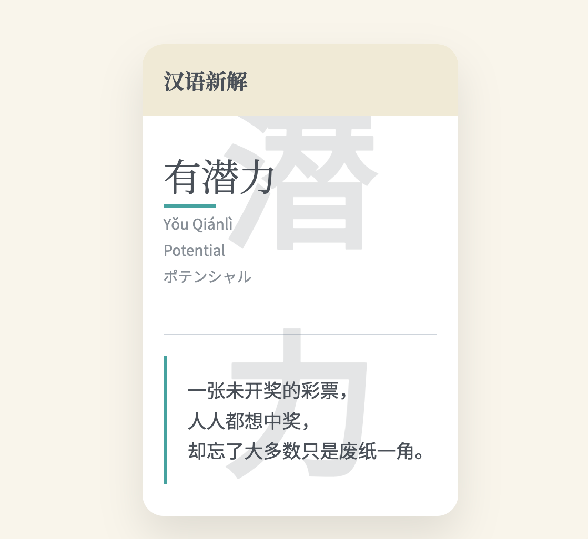
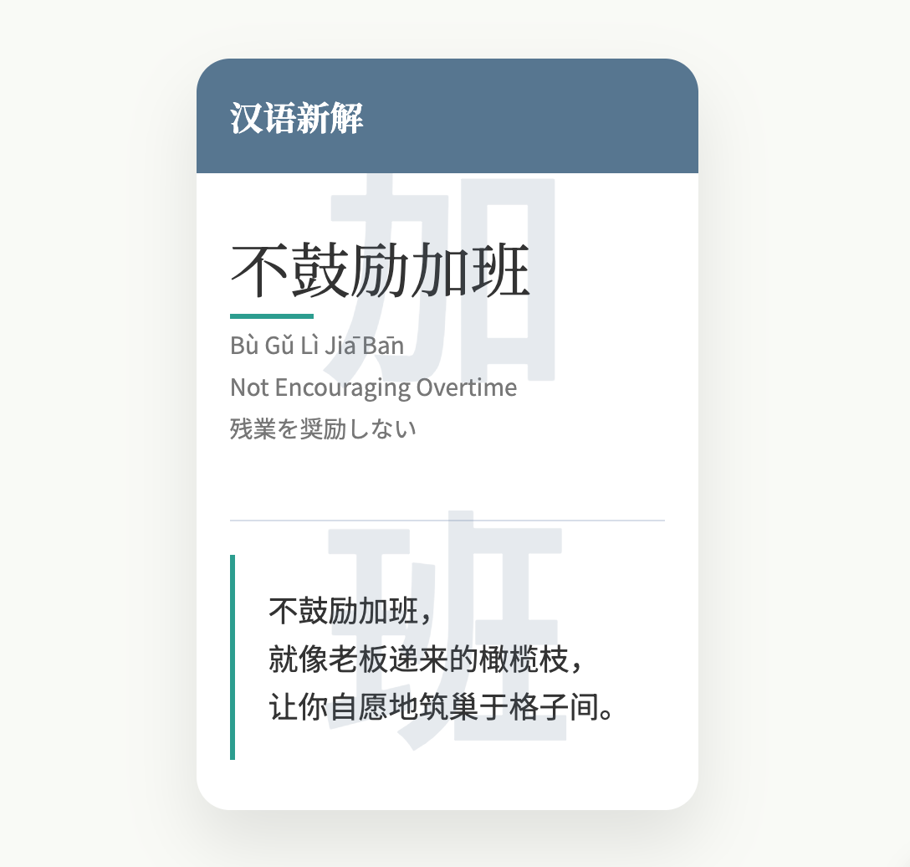
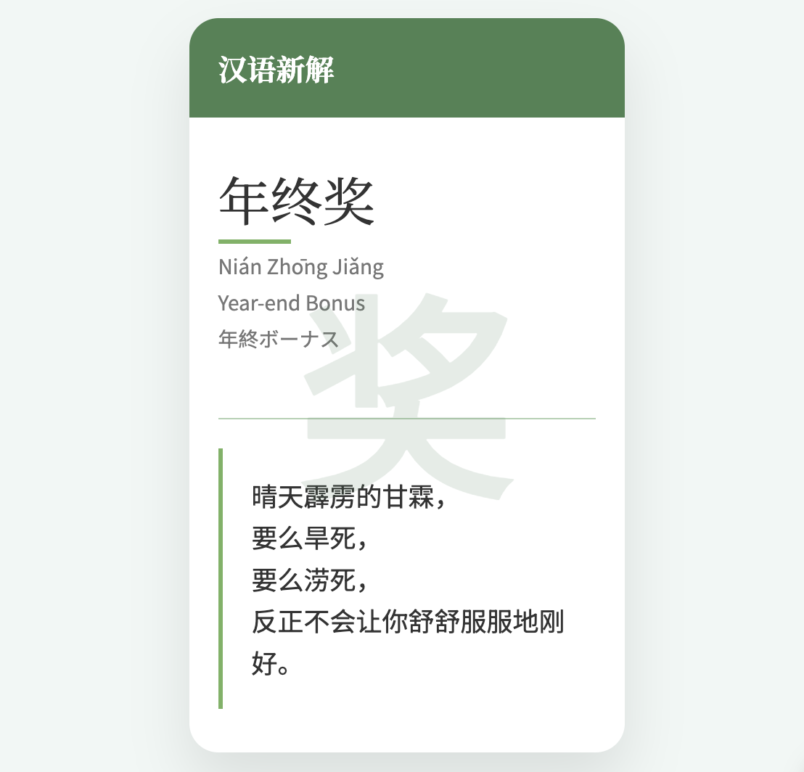

> 注意：模板调整内容，用于适配图片生成：
>
> * header 的高度和内边距
> * card 的宽度和高度


### 一、模板 1：绿色01

```
<!DOCTYPE html>
<html lang="zh">
<head>
    <meta charset="UTF-8">
    <meta name="viewport" content="width=device-width, initial-scale=1.0">
    <title>汉语新解 - {{word}}</title>
    <link href="https://fonts.googleapis.com/css2?family=Noto+Serif+SC:wght@400;700&family=Noto+Sans+SC:wght@300;400&display=swap" rel="stylesheet">
    <style>
        :root {
            /* 清新自然系：使用大自然中的颜色 */
            --primary-color: #8DB600; /* 清新的绿色，用于背景文字 */
            --secondary-color: #B0E0E6; /* 淡雅的青色，用于标题背景 */
            --accent-color: #32CD32; /* 生机勃勃的绿色，用于强调元素 */
            --background-color: #F0FFF0; /* 淡绿色，用于页面背景 */
            --text-color: #006400; /* 深绿色，用于主要文字 */
            --light-text-color: #6B8E23; /* 中绿色，用于次要文字 */
            --divider-color: #9ACD32; /* 柔和的绿色，用于分隔线 */
        }
        body, html {
            margin: 0;
            padding: 0;
            height: 100%;
            display: flex;
            justify-content: center;
            align-items: center;
            background-color: var(--background-color); /* 使用淡绿色作为页面背景 */
            font-family: 'Noto Sans SC', sans-serif;
            color: var(--text-color); /* 使用深绿色作为主要文字颜色 */
        }
        .card {
            width: 300px;
            height: auto;
            background-color: #F0FFF0; /* 淡绿色，用于卡片背景 */
            border-radius: 20px;
            box-shadow: 0 20px 40px rgba(0,0,0,0.1);
            overflow: hidden;
            position: relative;
            display: flex;
            flex-direction: column;
        }
        .header {
            background-color: var(--secondary-color); /* 使用淡雅的青色作为标题背景 */
            color: #F0FFF0; /* 浅色文字与深色背景形成对比 */
            padding: 20px;
            text-align: left;
            position: relative;
            z-index: 1;
        }
        h1 {
            font-family: 'Noto Serif SC', serif;
            font-size: 20px;
            margin: 0;
            font-weight: 700;
        }
        .content {
            padding: 30px 20px;
            display: flex;
            flex-direction: column;
            flex-grow: 1;
        }
        .word {
            text-align: left;
            margin-bottom: 20px;
        }
        .word-main {
            font-family: 'Noto Serif SC', serif;
            font-size: 36px;
            color: var(--text-color); /* 使用深绿色作为主要词汇颜色 */
            margin-bottom: 10px;
            position: relative;
        }
        .word-main::after {
            content: '';
            position: absolute;
            left: 0;
            bottom: -5px;
            width: 50px;
            height: 3px;
            background-color: var(--accent-color); /* 使用生机勃勃的绿色作为下划线 */
        }
        .word-sub {
            font-size: 14px;
            color: var(--light-text-color); /* 使用中绿色作为次要文字颜色 */
            margin: 5px 0;
        }
        .divider {
            width: 100%;
            height: 1px;
            background-color: var(--divider-color); /* 使用柔和的绿色作为分隔线 */
            margin: 20px 0;
        }
        .explanation {
            font-size: 18px;
            line-height: 1.6;
            text-align: left;
            flex-grow: 1;
            display: flex;
            flex-direction: column;
            justify-content: center;
        }
        .quote {
            position: relative;
            padding-left: 20px;
            border-left: 3px solid var(--accent-color); /* 使用生机勃勃的绿色作为引用边框 */
        }
        .background-text {
            position: absolute;
            font-size: 150px;
            color: rgba(133, 182, 0, 0.15); /* 使用清新的绿色的透明版本作为背景文字 */
            z-index: 0;
            top: 50%;
            left: 50%;
            transform: translate(-50%, -50%);
            font-weight: bold;
        }
    </style>
</head>
<body>
    <div class="card">
        <div class="header">
            <h1>汉语新解</h1>
        </div>
        <div class="content">
            <div class="word">
                <div class="word-main">{{word}}</div>
                <div class="word-sub">{{spell}}</div>
                <div class="word-sub">{{english}}</div>
                <div class="word-sub">{{japanese}}</div>
            </div>
            <div class="divider"></div>
            <div class="explanation">
                <div class="quote">
                    {{interpretation}}
                </div>
            </div>
        </div>
        <div class="background-text">{{summary}}</div>
    </div>
</body>
</html>
```




### 二、模板 2：蓝色01


```
<!DOCTYPE html>
<html lang="zh">
<head>
    <meta charset="UTF-8">
    <meta name="viewport" content="width=device-width, initial-scale=1.0">
    <title>汉语新解 - {{word}}</title>
    <link href="https://fonts.googleapis.com/css2?family=Noto+Serif+SC:wght@400;700&family=Noto+Sans+SC:wght@300;400&display=swap" rel="stylesheet">
    <style>
        :root {
            /* 清新自然系：使用清新、自然的颜色 */
            --primary-color: #7FB3D5; /* 天蓝色，用于背景文字 */
            --secondary-color: #AED6F1; /* 浅天蓝色，用于标题背景 */
            --accent-color: #6495ED; /* 深天蓝色，用于强调元素 */
            --background-color: #ECF0F1; /* 淡灰色，用于页面背景 */
            --text-color: #34495E; /* 深蓝色，用于主要文字 */
            --light-text-color: #7F8C8D; /* 中蓝色，用于次要文字 */
            --divider-color: #ABEBC6; /* 浅绿色，用于分隔线 */
        }
        body, html {
            margin: 0;
            padding: 0;
            height: 100%;
            display: flex;
            justify-content: center;
            align-items: center;
            background-color: var(--background-color);
            font-family: 'Noto Sans SC', sans-serif;
            color: var(--text-color);
        }
        .card {
            width: 300px;
            height: auto;
            background-color: #FFFFFF;
            border-radius: 20px;
            box-shadow: 0 20px 40px rgba(0,0,0,0.1);
            overflow: hidden;
            position: relative;
            display: flex;
            flex-direction: column;
        }
        .header {
            background-color: var(--secondary-color);
            color: #FFFFFF;
            padding: 20px;
            text-align: left;
            position: relative;
            z-index: 1;
        }
        h1 {
            font-family: 'Noto Serif SC', serif;
            font-size: 20px;
            margin: 0;
            font-weight: 700;
        }
        .content {
            padding: 30px 20px;
            display: flex;
            flex-direction: column;
            flex-grow: 1;
        }
        .word {
            text-align: left;
            margin-bottom: 20px;
        }
        .word-main {
            font-family: 'Noto Serif SC', serif;
            font-size: 36px;
            color: var(--text-color);
            margin-bottom: 10px;
            position: relative;
        }
        .word-main::after {
            content: '';
            position: absolute;
            left: 0;
            bottom: -5px;
            width: 50px;
            height: 3px;
            background-color: var(--accent-color);
        }
        .word-sub {
            font-size: 14px;
            color: var(--light-text-color);
            margin: 5px 0;
        }
        .divider {
            width: 100%;
            height: 1px;
            background-color: var(--divider-color);
            margin: 20px 0;
        }
        .explanation {
            font-size: 18px;
            line-height: 1.6;
            text-align: left;
            flex-grow: 1;
            display: flex;
            flex-direction: column;
            justify-content: center;
        }
        .quote {
            position: relative;
            padding-left: 20px;
            border-left: 3px solid var(--accent-color);
        }
        .background-text {
            position: absolute;
            font-size: 150px;
            color: rgba(127, 179, 213, 0.15);
            z-index: 0;
            top: 50%;
            left: 50%;
            transform: translate(-50%, -50%);
            font-weight: bold;
        }
    </style>
</head>
<body>
    <div class="card">
        <div class="header">
            <h1>汉语新解</h1>
        </div>
        <div class="content">
            <div class="word">
                <div class="word-main">{{word}}</div>
                <div class="word-sub">{{spell}}</div>
                <div class="word-sub">{{english}}</div>
                <div class="word-sub">{{japanese}}</div>
            </div>
            <div class="divider"></div>
            <div class="explanation">
                <div class="quote">
                    {{interpretation}}
                </div>
            </div>
        </div>
        <div class="background-text">{{summary}}</div>
    </div>
</body>
</html>
```




### 三、模板 3：绿色 02

```
<!DOCTYPE html>
<html lang="zh">
<head>
    <meta charset="UTF-8">
    <meta name="viewport" content="width=device-width, initial-scale=1.0">
    <title>汉语新解 - {{word}}</title>
    <link href="https://fonts.googleapis.com/css2?family=Noto+Serif+SC:wght@400;700&family=Noto+Sans+SC:wght@300;400&display=swap" rel="stylesheet">
    <style>
        :root {
            /* 清新自然系：使用大自然的色彩 */
            --primary-color: #78955C; /* 森林绿，用于标题文字 */
            --secondary-color: #DCE5C2; /* 苔藓绿，用于卡片背景 */
            --accent-color: #F2D39A; /* 土黄色，用于强调元素 */
            --background-color: #F9F5E7; /* 亚麻色，用于页面背景 */
            --text-color: #333; /* 深墨绿，用于主要文字 */
            --light-text-color: #555; /* 中墨绿，用于次要文字 */
            --divider-color: #E8DAC1; /* 米黄色，用于分隔线 */
        }
        body, html {
            margin: 0;
            padding: 0;
            height: 100%;
            display: flex;
            justify-content: center;
            align-items: center;
            background-color: var(--background-color);
            font-family: 'Noto Sans SC', sans-serif;
            color: var(--text-color);
        }
        .card {
            width: auto;
            height: auto;
            background-color: var(--secondary-color);
            border-radius: 20px;
            box-shadow: 0 20px 40px rgba(0,0,0,0.1);
            overflow: hidden;
            position: relative;
            display: flex;
            flex-direction: column;
            padding: 0;
        }
        .header {
            background-color: var(--primary-color);
            color: #F9F5E7;
            padding: 20px;
            text-align: left;
            position: relative;
            z-index: 1;
        }
        h1 {
            font-family: 'Noto Serif SC', serif;
            font-size: 20px;
            margin: 0;
            font-weight: 700;
        }
        .content {
            padding: 30px 20px;
            display: flex;
            flex-direction: column;
            flex-grow: 1;
        }
        .word {
            text-align: left;
            margin-bottom: 20px;
        }
        .word-main {
            font-family: 'Noto Serif SC', serif;
            font-size: 36px;
            color: var(--text-color);
            margin-bottom: 10px;
            position: relative;
        }
        .word-main::after {
            content: '';
            position: absolute;
            left: 0;
            bottom: -5px;
            width: 50px;
            height: 3px;
            background-color: var(--accent-color);
        }
        .word-sub {
            font-size: 14px;
            color: var(--light-text-color);
            margin: 5px 0;
        }
        .divider {
            width: 100%;
            height: 1px;
            background-color: var(--divider-color);
            margin: 20px 0;
        }
        .explanation {
            font-size: 18px;
            line-height: 1.6;
            text-align: left;
            flex-grow: 1;
            display: flex;
            flex-direction: column;
            justify-content: center;
        }
        .quote {
            position: relative;
            padding-left: 20px;
            border-left: 3px solid var(--accent-color);
        }
        .background-text {
            position: absolute;
            font-size: 150px;
            color: rgba(120, 149, 92, 0.15);
            z-index: 0;
            top: 50%;
            left: 50%;
            transform: translate(-50%, -50%);
            font-weight: bold;
        }
    </style>
</head>
<body>
    <div class="card">
        <div class="header">
            <h1>汉语新解</h1>
        </div>
        <div class="content">
            <div class="word">
                <div class="word-main">{{word}}</div>
                <div class="word-sub">{{spell}}</div>
                <div class="word-sub">{{english}}</div>
                <div class="word-sub">{{japanese}}</div>
            </div>
            <div class="divider"></div>
            <div class="explanation">
                <div class="quote">
                    {{interpretation}}
                </div>
            </div>
        </div>
        <div class="background-text">{{summary}}</div>
    </div>
</body>
</html>
```




### 四、模板 4：绿色 03

```
<!DOCTYPE html>
<html lang="zh">
<head>
    <meta charset="UTF-8">
    <meta name="viewport" content="width=device-width, initial-scale=1.0">
    <title>汉语新解 - {{word}}</title>
    <link href="https://fonts.googleapis.com/css2?family=Noto+Serif+SC:wght@400;700&family=Noto+Sans+SC:wght@300;400&display=swap" rel="stylesheet">
    <style>
        :root {
            /* 清新自然系：使用自然界的色彩 */
            --primary-color: #5CB85C; /* 清新的绿色，用于标题文字 */
            --secondary-color: #DFF0D8; /* 淡绿色，用于卡片背景 */
            --accent-color: #3D8B3D; /* 深绿色，用于强调元素 */
            --background-color: #F7F7E7; /* 米黄色，用于页面背景 */
            --text-color: #333; /* 深灰色，用于主要文字 */
            --light-text-color: #555; /* 中灰色，用于次要文字 */
            --divider-color: #BCE596; /* 浅绿色，用于分隔线 */
        }
        body, html {
            margin: 0;
            padding: 0;
            height: 100%;
            display: flex;
            justify-content: center;
            align-items: center;
            background-color: var(--background-color); /* 使用米黄色作为页面背景 */
            font-family: 'Noto Sans SC', sans-serif;
            color: var(--text-color); /* 使用深灰色作为主要文字颜色 */
        }
        .card {
            width: 300px;
            height: auto;
            background-color: var(--secondary-color); /* 使用淡绿色作为卡片背景 */
            border-radius: 20px;
            box-shadow: 0 20px 40px rgba(0,0,0,0.1);
            overflow: hidden;
            position: relative;
            display: flex;
            flex-direction: column;
        }
        .header {
            background-color: var(--primary-color); /* 使用清新的绿色作为标题背景 */
            color: #fff; /* 白色文字与深色背景形成对比 */
            padding: 20px;
            text-align: left;
            position: relative;
            z-index: 1;
        }
        h1 {
            font-family: 'Noto Serif SC', serif;
            font-size: 20px;
            margin: 0;
            font-weight: 700;
        }
        .content {
            padding: 30px 20px;
            display: flex;
            flex-direction: column;
            flex-grow: 1;
        }
        .word {
            text-align: left;
            margin-bottom: 20px;
        }
        .word-main {
            font-family: 'Noto Serif SC', serif;
            font-size: 36px;
            color: var(--text-color); /* 使用深灰色作为主要词汇颜色 */
            margin-bottom: 10px;
            position: relative;
        }
        .word-main::after {
            content: '';
            position: absolute;
            left: 0;
            bottom: -5px;
            width: 50px;
            height: 3px;
            background-color: var(--accent-color); /* 使用深绿色作为下划线 */
        }
        .word-sub {
            font-size: 14px;
            color: var(--light-text-color); /* 使用中灰色作为次要文字颜色 */
            margin: 5px 0;
        }
        .divider {
            width: 100%;
            height: 1px;
            background-color: var(--divider-color); /* 使用浅绿色作为分隔线 */
            margin: 20px 0;
        }
        .explanation {
            font-size: 18px;
            line-height: 1.6;
            text-align: left;
            flex-grow: 1;
            display: flex;
            flex-direction: column;
            justify-content: center;
        }
        .quote {
            position: relative;
            padding-left: 20px;
            border-left: 3px solid var(--accent-color); /* 使用深绿色作为引用边框 */
        }
        .background-text {
            position: absolute;
            font-size: 150px;
            color: rgba(92, 184, 92, 0.15); /* 使用清新的绿色的透明版本作为背景文字 */
            z-index: 0;
            top: 50%;
            left: 50%;
            transform: translate(-50%, -50%);
            font-weight: bold;
        }
    </style>
</head>
<body>
    <div class="card">
        <div class="header">
            <h1>汉语新解</h1>
        </div>
        <div class="content">
            <div class="word">
                <div class="word-main">{{word}}</div>
                <div class="word-sub">{{spell}}</div>
                <div class="word-sub">{{english}}</div>
                <div class="word-sub">{{japanese}}</div>
            </div>
            <div class="divider"></div>
            <div class="explanation">
                <div class="quote">
                    {{interpretation}}
                </div>
            </div>
        </div>
        <div class="background-text">{{summary}}</div>
    </div>
</body>
</html>
```




### 五、模板 5：绿色 04


```
<!DOCTYPE html>
<html lang="zh">
<head>
    <meta charset="UTF-8">
    <meta name="viewport" content="width=device-width, initial-scale=1.0">
    <title>汉语新解 - {{word}}</title>
    <link href="https://fonts.googleapis.com/css2?family=Noto+Serif+SC:wght@400;700&family=Noto+Sans+SC:wght@300;400&display=swap" rel="stylesheet">
    <style>
        :root {
            /* 清新自然系：使用大自然的色彩 */
            --primary-color: #7DB9B6; /* 淡青绿色，用于背景文字 */
            --secondary-color: #F0EAD6; /* 米白色，用于标题背景 */
            --accent-color: #45A29E; /* 深青绿色，用于强调元素 */
            --background-color: #F8F5EB; /* 浅米色，用于页面背景 */
            --text-color: #495057; /* 深墨绿色，用于主要文字 */
            --light-text-color: #868e96; /* 浅墨绿色，用于次要文字 */
            --divider-color: #CED4DA; /* 浅灰色，用于分隔线 */
        }
        body, html {
            margin: 0;
            padding: 0;
            height: 100%;
            display: flex;
            justify-content: center;
            align-items: center;
            background-color: var(--background-color); /* 使用浅米色作为页面背景 */
            font-family: 'Noto Sans SC', sans-serif;
            color: var(--text-color); /* 使用深墨绿色作为主要文字颜色 */
        }
        .card {
            width: 300px;
            height: auto;
            background-color: #FFFFFF; /* 白色，用于卡片背景 */
            border-radius: 20px;
            box-shadow: 0 20px 40px rgba(0,0,0,0.1);
            overflow: hidden;
            position: relative;
            display: flex;
            flex-direction: column;
        }
        .header {
            background-color: var(--secondary-color); /* 使用米白色作为标题背景 */
            color: #495057; /* 深墨绿色文字与米白色背景形成对比 */
            padding: 20px;
            text-align: left;
            position: relative;
            z-index: 1;
        }
        h1 {
            font-family: 'Noto Serif SC', serif;
            font-size: 20px;
            margin: 0;
            font-weight: 700;
        }
        .content {
            padding: 30px 20px;
            display: flex;
            flex-direction: column;
            flex-grow: 1;
        }
        .word {
            text-align: left;
            margin-bottom: 20px;
        }
        .word-main {
            font-family: 'Noto Serif SC', serif;
            font-size: 36px;
            color: var(--text-color); /* 使用深墨绿色作为主要词汇颜色 */
            margin-bottom: 10px;
            position: relative;
        }
        .word-main::after {
            content: '';
            position: absolute;
            left: 0;
            bottom: -5px;
            width: 50px;
            height: 3px;
            background-color: var(--accent-color); /* 使用深青绿色作为下划线 */
        }
        .word-sub {
            font-size: 14px;
            color: var(--light-text-color); /* 使用浅墨绿色作为次要文字颜色 */
            margin: 5px 0;
        }
        .divider {
            width: 100%;
            height: 1px;
            background-color: var(--divider-color); /* 使用浅灰色作为分隔线 */
            margin: 20px 0;
        }
        .explanation {
            font-size: 18px;
            line-height: 1.6;
            text-align: left;
            flex-grow: 1;
            display: flex;
            flex-direction: column;
            justify-content: center;
        }
        .quote {
            position: relative;
            padding-left: 20px;
            border-left: 3px solid var(--accent-color); /* 使用深青绿色作为引用边框 */
        }
        .background-text {
            position: absolute;
            font-size: 150px;
            color: rgba(73, 80, 87, 0.15); /* 使用深墨绿色的透明版本作为背景文字 */
            z-index: 0;
            top: 50%;
            left: 50%;
            transform: translate(-50%, -50%);
            font-weight: bold;
        }
    </style>
</head>
<body>
    <div class="card">
        <div class="header">
            <h1>汉语新解</h1>
        </div>
        <div class="content">
            <div class="word">
                <div class="word-main">{{word}}</div>
                <div class="word-sub">{{spell}}</div>
                <div class="word-sub">{{english}}</div>
                <div class="word-sub">{{japanese}}</div>
            </div>
            <div class="divider"></div>
            <div class="explanation">
                <div class="quote">
                    {{interpretation}}
                </div>
            </div>
        </div>
        <div class="background-text">{{summary}}</div>
    </div>
</body>
</html>
```



### 六、模板 6：蓝色 02

```
<!DOCTYPE html>
<html lang="zh">
<head>
    <meta charset="UTF-8">
    <meta name="viewport" content="width=device-width, initial-scale=1.0">
    <title>汉语新解 - {{word}}</title>
    <link href="https://fonts.googleapis.com/css2?family=Noto+Serif+SC:wght@400;700&family=Noto+Sans+SC:wght@300;400&display=swap" rel="stylesheet">
    <style>
        :root {
            /* 清新自然系：使用大自然中的颜色 */
            --primary-color: #577590; /* 天青石蓝，用于标题背景 */
            --secondary-color: #EDF2F4; /* 浅灰色，用于背景文字 */
            --accent-color: #2A9D8F; /* 海洋绿，用于强调元素 */
            --background-color: #F8FAF5; /* 轻柔的绿色，用于页面背景 */
            --text-color: #333; /* 深灰色，用于主要文字 */
            --light-text-color: #777; /* 中灰色，用于次要文字 */
            --divider-color: #D8DEE9; /* 浅灰色，用于分隔线 */
        }
        body, html {
            margin: 0;
            padding: 0;
            height: 100%;
            display: flex;
            justify-content: center;
            align-items: center;
            background-color: var(--background-color); /* 使用轻柔的绿色作为页面背景 */
            font-family: 'Noto Sans SC', sans-serif;
            color: var(--text-color); /* 使用深灰色作为主要文字颜色 */
        }
        .card {
            width: 300px;
            height: auto;
            background-color: #FFFFFF; /* 白色，用于卡片背景 */
            border-radius: 20px;
            box-shadow: 0 20px 40px rgba(0,0,0,0.1);
            overflow: hidden;
            position: relative;
            display: flex;
            flex-direction: column;
        }
        .header {
            background-color: var(--primary-color); /* 使用天青石蓝作为标题背景 */
            color: #FFFFFF; /* 白色文字与深色背景形成对比 */
            padding: 20px;
            text-align: left;
            position: relative;
            z-index: 1;
        }
        h1 {
            font-family: 'Noto Serif SC', serif;
            font-size: 20px;
            margin: 0;
            font-weight: 700;
        }
        .content {
            padding: 30px 20px;
            display: flex;
            flex-direction: column;
            flex-grow: 1;
        }
        .word {
            text-align: left;
            margin-bottom: 20px;
        }
        .word-main {
            font-family: 'Noto Serif SC', serif;
            font-size: 36px;
            color: var(--text-color); /* 使用深灰色作为主要词汇颜色 */
            margin-bottom: 10px;
            position: relative;
        }
        .word-main::after {
            content: '';
            position: absolute;
            left: 0;
            bottom: -5px;
            width: 50px;
            height: 3px;
            background-color: var(--accent-color); /* 使用海洋绿作为下划线 */
        }
        .word-sub {
            font-size: 14px;
            color: var(--light-text-color); /* 使用中灰色作为次要文字颜色 */
            margin: 5px 0;
        }
        .divider {
            width: 100%;
            height: 1px;
            background-color: var(--divider-color); /* 使用浅灰色作为分隔线 */
            margin: 20px 0;
        }
        .explanation {
            font-size: 18px;
            line-height: 1.6;
            text-align: left;
            flex-grow: 1;
            display: flex;
            flex-direction: column;
            justify-content: center;
        }
        .quote {
            position: relative;
            padding-left: 20px;
            border-left: 3px solid var(--accent-color); /* 使用海洋绿作为引用边框 */
        }
        .background-text {
            position: absolute;
            font-size: 150px;
            color: rgba(87, 117, 144, 0.15); /* 使用天青石蓝的透明版本作为背景文字 */
            z-index: 0;
            top: 50%;
            left: 50%;
            transform: translate(-50%, -50%);
            font-weight: bold;
        }
    </style>
</head>
<body>
    <div class="card">
        <div class="header">
            <h1>汉语新解</h1>
        </div>
        <div class="content">
            <div class="word">
                <div class="word-main">{{word}}</div>
                <div class="word-sub">{{spell}}</div>
                <div class="word-sub">{{english}}</div>
                <div class="word-sub">{{japanese}}</div>
            </div>
            <div class="divider"></div>
            <div class="explanation">
                <div class="quote">
                    {{interpretation}}
                </div>
            </div>
        </div>
        <div class="background-text">{{summary}}</div>
    </div>
</body>
</html>
```



### 七、模板 7：绿色 05


```
<!DOCTYPE html>
<html lang="zh">
<head>
    <meta charset="UTF-8">
    <meta name="viewport" content="width=device-width, initial-scale=1.0">
    <title>汉语新解 - {{word}}</title>
    <link href="https://fonts.googleapis.com/css2?family=Noto+Serif+SC:wght@400;700&family=Noto+Sans+SC:wght@300;400&display=swap" rel="stylesheet">
    <style>
        :root {
            /* 清新自然系：使用大自然中的色彩 */
            --primary-color: #588157; /* 森林绿，用于标题背景 */
            --secondary-color: #DCE9D2; /* 苔藓绿，用于背景文字 */
            --accent-color: #82B169; /* 新芽绿，用于强调元素 */
            --background-color: #F2F7F5; /* 淡绿色，用于页面背景 */
            --text-color: #333; /* 深绿色，用于主要文字 */
            --light-text-color: #777; /* 中绿色，用于次要文字 */
            --divider-color: #B7D0B4; /* 浅苔藓绿，用于分隔线 */
        }
        body, html {
            margin: 0;
            padding: 0;
            height: 100%;
            display: flex;
            justify-content: center;
            align-items: center;
            background-color: var(--background-color);
            font-family: 'Noto Sans SC', sans-serif;
            color: var(--text-color);
        }
        .card {
            width: 300px;
            height: auto;
            background-color: #fff;
            border-radius: 20px;
            box-shadow: 0 20px 40px rgba(0,0,0,0.1);
            overflow: hidden;
            position: relative;
            display: flex;
            flex-direction: column;
        }
        .header {
            background-color: var(--primary-color);
            color: #fff;
            padding: 20px;
            text-align: left;
            position: relative;
            z-index: 1;
        }
        h1 {
            font-family: 'Noto Serif SC', serif;
            font-size: 20px;
            margin: 0;
            font-weight: 700;
        }
        .content {
            padding: 30px 20px;
            display: flex;
            flex-direction: column;
            flex-grow: 1;
        }
        .word {
            text-align: left;
            margin-bottom: 20px;
        }
        .word-main {
            font-family: 'Noto Serif SC', serif;
            font-size: 36px;
            color: var(--text-color);
            margin-bottom: 10px;
            position: relative;
        }
        .word-main::after {
            content: '';
            position: absolute;
            left: 0;
            bottom: -5px;
            width: 50px;
            height: 3px;
            background-color: var(--accent-color);
        }
        .word-sub {
            font-size: 14px;
            color: var(--light-text-color);
            margin: 5px 0;
        }
        .divider {
            width: 100%;
            height: 1px;
            background-color: var(--divider-color);
            margin: 20px 0;
        }
        .explanation {
            font-size: 18px;
            line-height: 1.6;
            text-align: left;
            flex-grow: 1;
            display: flex;
            flex-direction: column;
            justify-content: center;
        }
        .quote {
            position: relative;
            padding-left: 20px;
            border-left: 3px solid var(--accent-color);
        }
        .background-text {
            position: absolute;
            font-size: 150px;
            color: rgba(88, 129, 87, 0.15);
            z-index: 0;
            top: 50%;
            left: 50%;
            transform: translate(-50%, -50%);
            font-weight: bold;
        }
    </style>
</head>
<body>
    <div class="card">
        <div class="header">
            <h1>汉语新解</h1>
        </div>
        <div class="content">
            <div class="word">
                <div class="word-main">{{word}}</div>
                <div class="word-sub">{{spell}}</div>
                <div class="word-sub">{{english}}</div>
                <div class="word-sub">{{japanese}}</div>
            </div>
            <div class="divider"></div>
            <div class="explanation">
                <div class="quote">
                    {{interpretation}}
                </div>
            </div>
        </div>
        <div class="background-text">{{summary}}</div>
    </div>
</body>
</html>
```




