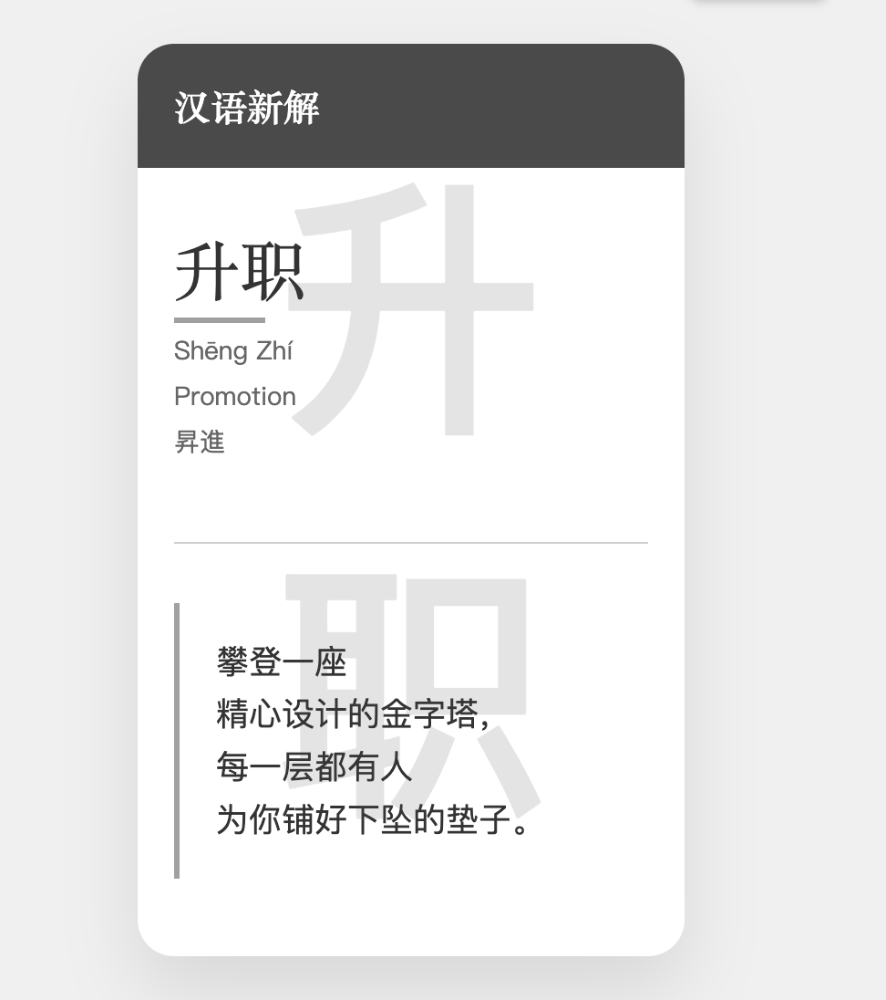
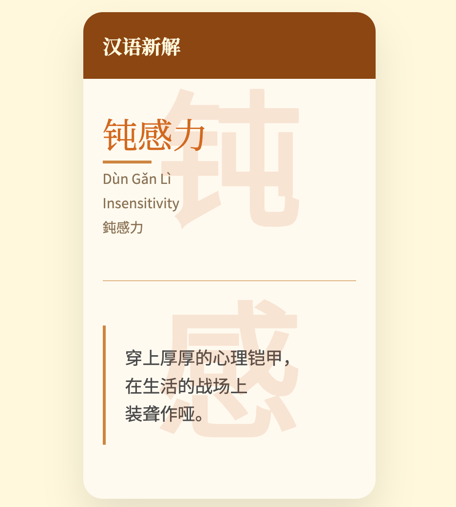

### 八、模板 8：灰色 01

```
<!DOCTYPE html>
<html lang="zh">
<head>
    <meta charset="UTF-8">
    <meta name="viewport" content="width=device-width, initial-scale=1.0">
    <title>汉语新解 - {{word}}</title>
    <link href="https://fonts.googleapis.com/css2?family=Noto+Serif+SC:wght@400;700&family=Noto+Sans+SC:wght@300;400&display=swap" rel="stylesheet">
    <style>
        :root {
            /* 高雅灰度系 */
            --primary-color: #4A4A4A;
            --secondary-color: #787878;
            --accent-color: #A0A0A0;
            --background-color: #F0F0F0;
            --text-color: #333333;
            --light-text-color: #666666;
            --divider-color: #D0D0D0;
        }
        body, html {
            margin: 0;
            padding: 0;
            height: 100%;
            display: flex;
            justify-content: center;
            align-items: center;
            background-color: var(--background-color);
            font-family: 'Noto Sans SC', sans-serif;
            color: var(--text-color);
        }
        .card {
            width: 300px;
            height: 500px;
            background-color: #FFFFFF;
            border-radius: 20px;
            box-shadow: 0 20px 40px rgba(0,0,0,0.1);
            overflow: hidden;
            position: relative;
            display: flex;
            flex-direction: column;
        }
        .header {
            background-color: var(--primary-color);
            color: #FFFFFF;
            padding: 20px;
            text-align: left;
            position: relative;
            z-index: 1;
        }
        h1 {
            font-family: 'Noto Serif SC', serif;
            font-size: 20px;
            margin: 0;
            font-weight: 700;
        }
        .content {
            padding: 30px 20px;
            display: flex;
            flex-direction: column;
            flex-grow: 1;
        }
        .word {
            text-align: left;
            margin-bottom: 20px;
        }
        .word-main {
            font-family: 'Noto Serif SC', serif;
            font-size: 36px;
            color: var(--text-color);
            margin-bottom: 10px;
            position: relative;
        }
        .word-main::after {
            content: '';
            position: absolute;
            left: 0;
            bottom: -5px;
            width: 50px;
            height: 3px;
            background-color: var(--accent-color);
        }
        .word-sub {
            font-size: 14px;
            color: var(--light-text-color);
            margin: 5px 0;
        }
        .divider {
            width: 100%;
            height: 1px;
            background-color: var(--divider-color);
            margin: 20px 0;
        }
        .explanation {
            font-size: 18px;
            line-height: 1.6;
            text-align: left;
            flex-grow: 1;
            display: flex;
            flex-direction: column;
            justify-content: center;
        }
        .quote {
            position: relative;
            padding-left: 20px;
            border-left: 3px solid var(--accent-color);
        }
        .background-text {
            position: absolute;
            font-size: 150px;
            color: rgba(74, 74, 74, 0.15);
            z-index: 0;
            top: 50%;
            left: 50%;
            transform: translate(-50%, -50%);
            font-weight: bold;
        }
    </style>
</head>
<body>
    <div class="card">
        <div class="header">
            <h1>汉语新解</h1>
        </div>
        <div class="content">
            <div class="word">
                <div class="word-main">{{word}}</div>
                <div class="word-sub">{{spell}}</div>
                <div class="word-sub">{{english}}</div>
                <div class="word-sub">{{japanese}}</div>
            </div>
            <div class="divider"></div>
            <div class="explanation">
                <div class="quote">
                    {{interpretation}}
                </div>
            </div>
        </div>
        <div class="background-text">{{summary}}</div>
    </div>
</body>
</html>
```




### 九、模板 9：深蓝 01

```
<!DOCTYPE html>
<html lang="zh">
<head>
    <meta charset="UTF-8">
    <meta name="viewport" content="width=device-width, initial-scale=1.0">
    <title>汉语新解 - 氛围感</title>
    <link href="https://fonts.googleapis.com/css2?family=Noto+Serif+SC:wght@400;700&family=Noto+Sans+SC:wght@300;400&display=swap" rel="stylesheet">
    <style>
        :root {
            --primary-color: #2C3E50;
            --secondary-color: #34495E;
            --accent-color: #7F8C8D;
            --background-color: #ECF0F1;
            --text-color: #2C3E50;
            --light-text-color: #7F8C8D;
            --divider-color: #BDC3C7;
        }
        body, html {
            margin: 0;
            padding: 0;
            height: 100%;
            display: flex;
            justify-content: center;
            align-items: center;
            background-color: var(--background-color);
            font-family: 'Noto Sans SC', sans-serif;
            color: var(--text-color);
        }
        .card {
            width: 300px;
            height: 500px;
            background-color: #FFFFFF;
            border-radius: 20px;
            box-shadow: 0 20px 40px rgba(0,0,0,0.1);
            overflow: hidden;
            position: relative;
            display: flex;
            flex-direction: column;
        }
        .header {
            background-color: var(--primary-color);
            color: #FFFFFF;
            padding: 20px;
            text-align: left;
            position: relative;
            z-index: 1;
        }
        h1 {
            font-family: 'Noto Serif SC', serif;
            font-size: 20px;
            margin: 0;
            font-weight: 700;
        }
        .content {
            padding: 30px 20px;
            display: flex;
            flex-direction: column;
            flex-grow: 1;
        }
        .word {
            text-align: left;
            margin-bottom: 20px;
        }
        .word-main {
            font-family: 'Noto Serif SC', serif;
            font-size: 36px;
            color: var(--text-color);
            margin-bottom: 10px;
            position: relative;
        }
        .word-main::after {
            content: '';
            position: absolute;
            left: 0;
            bottom: -5px;
            width: 50px;
            height: 3px;
            background-color: var(--accent-color);
        }
        .word-sub {
            font-size: 14px;
            color: var(--light-text-color);
            margin: 5px 0;
        }
        .divider {
            width: 100%;
            height: 1px;
            background-color: var(--divider-color);
            margin: 20px 0;
        }
        .explanation {
            font-size: 18px;
            line-height: 1.6;
            text-align: left;
            flex-grow: 1;
            display: flex;
            flex-direction: column;
            justify-content: center;
        }
        .quote {
            position: relative;
            padding-left: 20px;
            border-left: 3px solid var(--accent-color);
        }
        .background-text {
            position: absolute;
            font-size: 150px;
            color: rgba(44, 62, 80, 0.05);
            z-index: 0;
            top: 50%;
            left: 50%;
            transform: translate(-50%, -50%);
            font-weight: bold;
        }
    </style>
</head>
<body>
    <div class="card">
        <div class="header">
            <h1>汉语新解</h1>
        </div>
        <div class="content">
            <div class="word">
                <div class="word-main">{{word}}</div>
                <div class="word-sub">{{spell}}</div>
                <div class="word-sub">{{english}}</div>
                <div class="word-sub">{{japanese}}</div>
            </div>
            <div class="divider"></div>
            <div class="explanation">
                <div class="quote">
                    {{interpretation}}
                </div>
            </div>
        </div>
        <div class="background-text">{{summary}}</div>
    </div>
</body>
</html>
```


### 十、模板 10：棕色01

```
<!DOCTYPE html>
<html lang="zh">
<head>
    <meta charset="UTF-8">
    <meta name="viewport" content="width=device-width, initial-scale=1.0">
    <title>汉语新解 - {{word}}</title>
    <link href="https://fonts.googleapis.com/css2?family=Noto+Serif+SC:wght@400;700&family=Noto+Sans+SC:wght@300;400&display=swap" rel="stylesheet">
    <style>
        :root {
            /* 秋季丰收系 */
            --primary-color: #D2691E; /* 巧克力色 */
            --secondary-color: #8B4513; /* 马鞍棕色 */
            --accent-color: #CD853F; /* 秘鲁色 */
            --background-color: #FFF8DC; /* 玉米色 */
            --text-color: #4A4A4A; /* 深灰色 */
            --light-text-color: #8B7355; /* 马鞍棕色的浅色版 */
            --divider-color: #DEB887; /* 实木色 */
        }
        body, html {
            margin: 0;
            padding: 0;
            height: 100%;
            display: flex;
            justify-content: center;
            align-items: center;
            background-color: var(--background-color);
            font-family: 'Noto Sans SC', sans-serif;
            color: var(--text-color);
        }
        .card {
            width: 300px;
            height: 500px;
            background-color: #FFFAF0; /* 花白色 */
            border-radius: 20px;
            box-shadow: 0 20px 40px rgba(0,0,0,0.1);
            overflow: hidden;
            position: relative;
            display: flex;
            flex-direction: column;
        }
        .header {
            background-color: var(--secondary-color);
            color: #FFF8DC;
            padding: 20px;
            text-align: left;
            position: relative;
            z-index: 1;
        }
        h1 {
            font-family: 'Noto Serif SC', serif;
            font-size: 20px;
            margin: 0;
            font-weight: 700;
        }
        .content {
            padding: 30px 20px;
            display: flex;
            flex-direction: column;
            flex-grow: 1;
        }
        .word {
            text-align: left;
            margin-bottom: 20px;
        }
        .word-main {
            font-family: 'Noto Serif SC', serif;
            font-size: 36px;
            color: var(--primary-color);
            margin-bottom: 10px;
            position: relative;
        }
        .word-main::after {
            content: '';
            position: absolute;
            left: 0;
            bottom: -5px;
            width: 50px;
            height: 3px;
            background-color: var(--accent-color);
        }
        .word-sub {
            font-size: 14px;
            color: var(--light-text-color);
            margin: 5px 0;
        }
        .divider {
            width: 100%;
            height: 1px;
            background-color: var(--divider-color);
            margin: 20px 0;
        }
        .explanation {
            font-size: 18px;
            line-height: 1.6;
            text-align: left;
            flex-grow: 1;
            display: flex;
            flex-direction: column;
            justify-content: center;
        }
        .quote {
            position: relative;
            padding-left: 20px;
            border-left: 3px solid var(--accent-color);
        }
        .background-text {
            position: absolute;
            font-size: 150px;
            color: rgba(210, 105, 30, 0.15); /* 使用巧克力色的透明版本作为背景文字 */
            z-index: 0;
            top: 50%;
            left: 50%;
            transform: translate(-50%, -50%);
            font-weight: bold;
        }
    </style>
</head>
<body>
    <div class="card">
        <div class="header">
            <h1>汉语新解</h1>
        </div>
        <div class="content">
            <div class="word">
                <div class="word-main">{{word}}</div>
                <div class="word-sub">{{spell}}</div>
                <div class="word-sub">{{english}}</div>
                <div class="word-sub">{{japanese}}</div>
            </div>
            <div class="divider"></div>
            <div class="explanation">
                <div class="quote">
                    {{interpretation}}
                </div>
            </div>
        </div>
        <div class="background-text">{{summary}}</div>
    </div>
</body>
</html>
```





